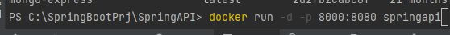
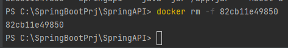

# DockerizeSpringAPI
create spring project using spring.io
  1. select Java 17
  2. Select Maven

Create simple userservice application
  - create packages
     - api - UserController.java
     - model - User.java
     - service - UserService.java

**[ userController.java ]**
________
package com.example.springapi.api;

import com.example.springapi.model.User;

import com.example.springapi.service.UserService;

import org.springframework.beans.factory.annotation.Autowired;

import org.springframework.http.ResponseEntity;

import org.springframework.web.bind.annotation.*;

@RestController

@RequestMapping("/users")

public class UserController {

private final UserService userService;

    @Autowired
    public UserController(UserService userService){
        this.userService = userService;
    }
    @GetMapping("/{id}")
    public ResponseEntity<User> getUserById(@PathVariable Long id){
        User user = userService.getUserById(id);
        if(user != null){
            return ResponseEntity.ok(user);
        }else{
            return ResponseEntity.notFound().build();
        }
    }
}

**[ user.java ]**
________
package com.example.springapi.model;

public class User {

private Long id;

private String username;

private String email;

    public User() {
    }

    public User(Long id, String username, String email) {
        this.id = id;
        this.username = username;
        this.email = email;
    }

    public void setId(Long id) {
        this.id = id;
    }

    public void setUsername(String username) {
        this.username = username;
    }

    public void setEmail(String email) {
        this.email = email;
    }

    public Long getId() {
        return id;
    }

    public String getUsername() {
        return username;
    }

    public String getEmail() {
        return email;
    }
}

**[ UserService.java ]**
________

import com.example.springapi.model.User;

import org.springframework.stereotype.Service;

import java.util.ArrayList;

import java.util.List;

@Service

public class UserService {

private List<User> userList;

    public UserService(){
        userList = new ArrayList<>();
        userList.add(new User(1L,"John Doe","joh@example.com"));
        userList.add(new User(2L,"Alice Smith","alice@example.com"));
        userList.add(new User(3L,"Bob John","bob@example.com"));
    }

    public List<User> getAllUsers(){
        return userList;
    }

    public User getUserById(Long id){
        return userList.stream().
                filter(user->user.getId().equals(id))
                .findFirst()
                .orElse(null);
    }
}

[Use Maven in IntelliJ]
- **First ,Clean Project** 

- **Second, Install**

[check the generated jar file inside of target folder]

Based on the contents inside of pom.xml

[Create Dockerfile]
****
FROM openjdk:17-jdk-alpine

ARG JAR_FILE=target/*.jar

COPY ./target/SpringAPI-0.0.1.jar app.jar

ENTRYPOINT ["java","-jar","/app.jar"]

[Create Docker image]
****

[Check the created docker image]
****

[Run Docker]
****

[Run browser]
***

[Check the running Docker Container] 
****

[remove the running docker container] 
****

 